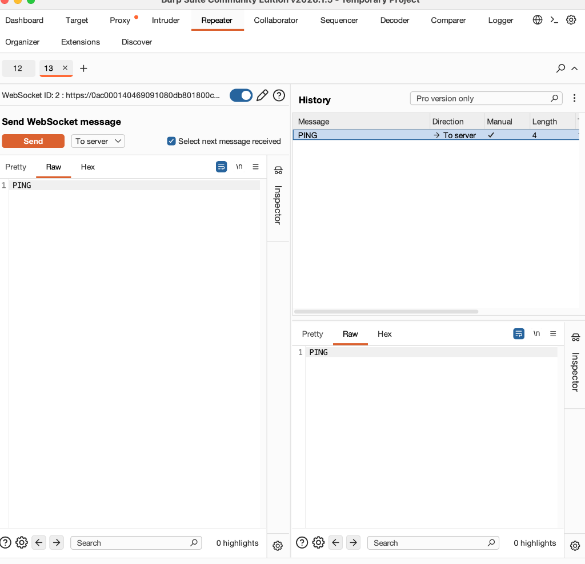

# Network Security Lab: ARP Spoofing 기반 MITM 분석
**작성자:** 장민혁

본 레포지토리는 로컬 네트워크(LAN) 환경에서 발생하는 ARP(Address Resolution Protocol)의 구조적 취약점을 악용하여, 통신 패킷을 중간에서 가로채는 ARP Cache Poisoning 및 MITM(Man-in-the-Middle) 공격의 원리를 입증하고 분석한 포트폴리오입니다.

## 1. 실습 목적
- ARP 프로토콜의 동작 원리와 한계점(인증 절차 부재)을 명확히 이해한다.
- ARP Cache Poisoning을 통해 공격자가 게이트웨이와 타겟 사이의 트래픽을 가로채는 중간자(MITM) 공격 구조를 기술적으로 분석한다.
- 네트워크 기반 공격을 탐지하고 방어하기 위한 시큐어 네트워크 아키텍처에 대한 인사이트를 도출한다.

---

## 2. 실습 환경
- **Attacker (공격자)**: Kali Linux (또는 공격용 가상 환경)
- **Target (피해자)**: 동일 로컬 네트워크(LAN) 상의 호스트 (예: Windows / Ubuntu)
- **분석 도구**: 
  - 공격 수행: `arpspoof` (또는 `ettercap`)
  - 패킷 분석: `Wireshark` (네트워크 패킷 캡처 및 심층 분석 도구)

---

## 3. ARP 프로토콜 개요 및 취약점
ARP(Address Resolution Protocol)는 논리적인 **IP 주소를 물리적인 MAC 주소로 변환**하기 위해 사용하는 2계층(Data Link Layer) 프로토콜입니다.

### ⚠️ 구조적 특징 (취약점의 원인)
- **인증 절차(Authentication) 부재**: 응답을 보낸 기기가 정말로 해당 IP 주소의 소유자가 맞는지 신원 검증 절차가 아예 없습니다.
- **맹목적 신뢰 및 캐시 기록**: 네트워크 상에서 ARP Reply(응답) 패킷을 수신하면, 내용의 진위 여부를 떠나 무조건 자신의 캐시(Cache) 테이블에 갱신 및 저장합니다.
- **요청하지 않은 Reply도 수용**: 자신이 ARP를 묻지도(Request) 않았는데, 누군가 먼저 다짜고짜 "내 번호 이거야(Unsolicited Reply)" 라고 알려줘도 이를 순순히 받아들이는 취약점이 있습니다.

**→ 결론**: 이러한 프로토콜 설계상의 구조적 결함으로 인해, 악의적인 공격자가 위조된 MAC 주소를 방송(Broadcast)하거나 타겟에게 지속 전송하는 **ARP Spoofing 공격이 가능해집니다.**

---

## 4. 공격 과정 및 메커니즘 분석

공격자는 다음과 같은 과정으로 패킷의 흐름을 장악하고 중간자 통신(MITM)을 성립시킵니다.

1. **공격 툴 실행 (`send_arp` / `arpspoof`)**
   - 공격용 OS(Kali) 환경에서 위장용 ARP 패킷을 지속적으로 찍어내는 도구를 가동합니다.
   - *(작업 예시 화면 1)*: Kali Linux에서 타겟(`10.0.2.4` 및 `10.0.2.1`)을 향해 조작된 MAC 주소(`08:00:27:e4:1f:47`)를 담은 ARP Reply 패킷을 밀어넣는(Spoofing) 과정을 수행했습니다.
   
   
   
2. **피해자(Target) 대상 기만 전송**
   - 공격자는 일반 피해자 PC(Ubuntu 등)에게 **"야, 내가 게이트웨이(공유기)야. 내 진짜 MAC 주소는 `08:00:27:e4:1f:47` (공격자 MAC) 이야!"** 라고 거짓 ARP Reply를 지속적으로 보냅니다.
   
3. **게이트웨이(Router) 대상 기만 전송 (양방향 스푸핑)**
   - 동시에 실제 라우터(공유기) 측에도 위조 전송하여 인터넷으로 나가는 길목의 장비 테이블마저 엉망으로 만듭니다.
   
4. **MITM (Man-in-the-Middle) 상태 완성 및 유도**
   - 양쪽 통신 테이블이 오염된 상태가 되었기 때문에, **피해자와 게이트웨이 간 모든 트래픽(인터넷 내용)이 공격자를 반드시 거쳐(경유)서 가도록 유도됩니다.**

---

## 5. ARP 테이블 확인 (검증)

피해자 PC의 터미널이나 CMD(명령 프롬프트) 창을 열어, ARP 캐시 테이블을 직접 출력하여 공격의 성공 여부를 증명합니다.

```bash
# ARP 캐시 테이블 조회 명령어
arp -a
```

**[공격 성공 증명 화면]**
피해자 PC(Ubuntu `10.0.2.x` 대역)에서 명령어 실행 결과, 서로 다른 두 개의 IP(`10.0.2.1` 게이트웨이와 `10.0.2.3` 등)가 **동일한 하나의 MAC 주소(`08:00:27:e4:1f:47` - 공격자 장비)**로 도배되어 있는 치명적인 캐시 오염(Poisoning) 상태를 확인했습니다.



---

## 6. 방어 및 대응 방안 (Mitigation)
본 취약점 분석을 통해 웹 기반 소프트웨어 보안뿐만 아니라 인프라(네트워크 계층) 보안도 매우 중요함을 파악했습니다. 기업 및 클라우드 인프라에서는 아래와 같은 아키텍처 레벨의 방어 기술을 필수로 채택하고 있습니다.

1. **정적 테이블 구성 (Static ARP)**: 핵심 사내망 서버나 게이트웨이에서는 MAC 주소가 변경되지 못하도록 수동으로 고정(하드코딩)하여 동적 변조를 무력화합니다.
2. **네트워크 장비 보안 (Dynamic ARP Inspection, DAI)**: L2 엔터프라이즈 스위치 장비에서 DHCP 스누핑 바인딩 데이터베이스와 실시간으로 대조검사하여, 위조된 MAC 응답 패킷이 포트(Port)를 통과하지 못하도록 즉시 폐기(Drop) 시킵니다.
3. **종단 간 암호화(HTTPS / E2EE)**: 최후의 방어선으로, 해커가 ARP 공격을 통해 패킷을 가로챘다 하더라도 내용을 영원히 알아볼 수 없도록 모든 중요 통신을 암호화(TLS/SSL)합니다.
